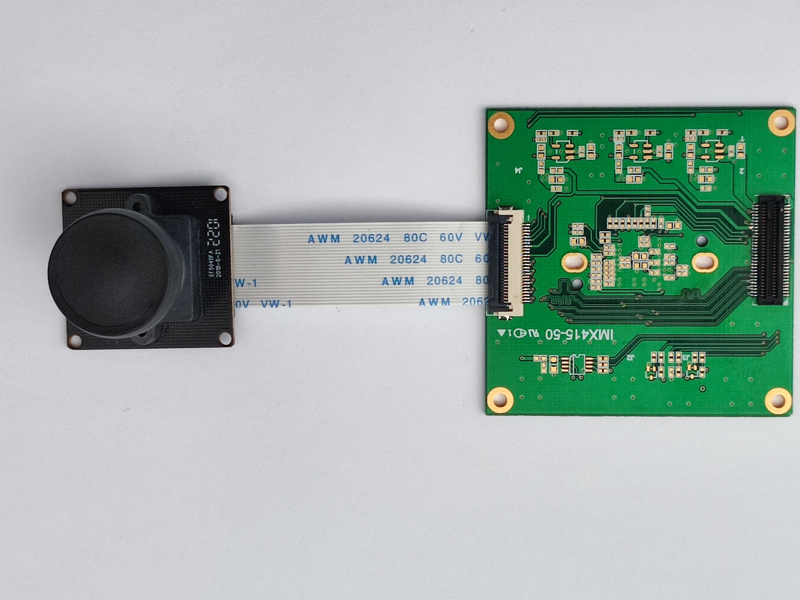
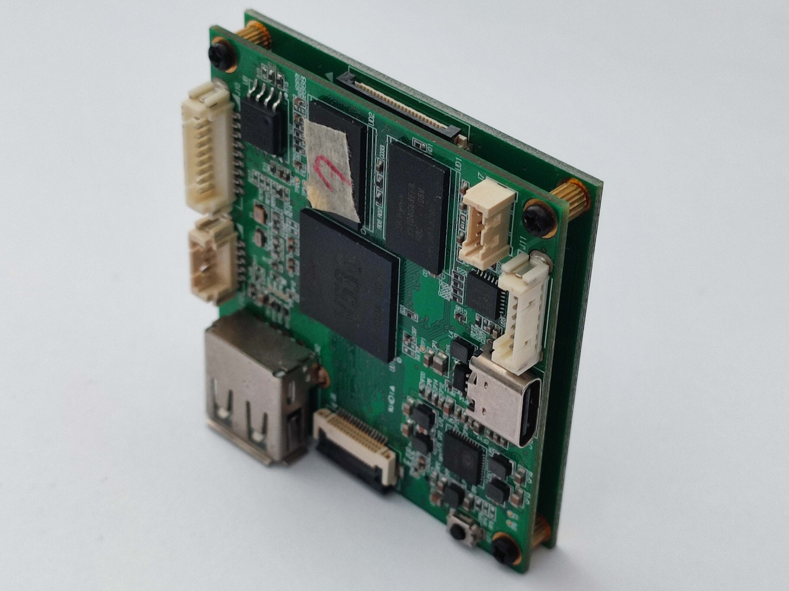
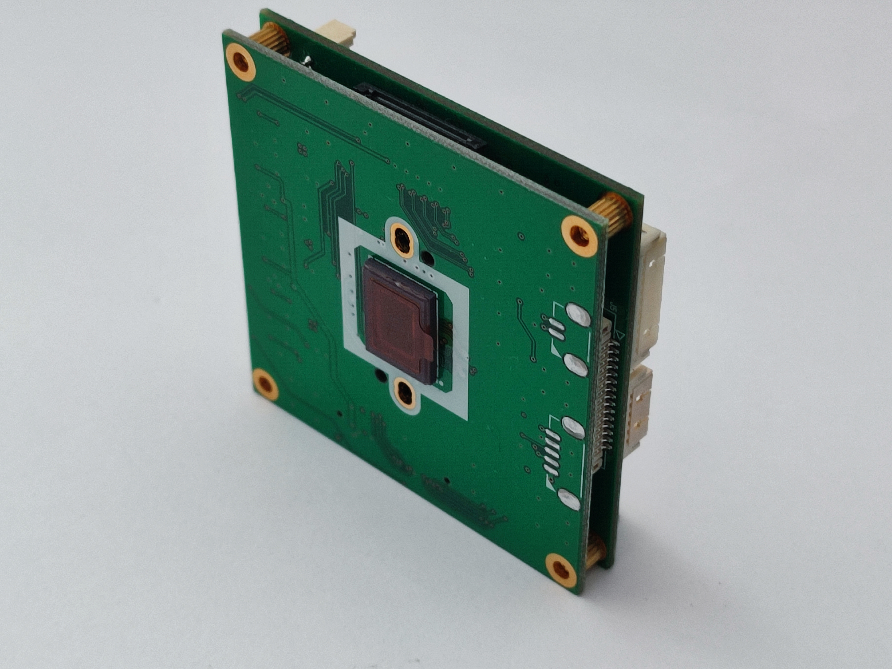

**Flag Linux** is a lightweight Linux distribution designed specifically for AI edge devices. It is tailored to provide a streamlined, efficient, and robust operating system for AI-driven applications and situational awareness tasks.

## Features
- Optimized for AI edge computing
- Lightweight and minimal footprint
- Supports hardware acceleration for AI workloads
- Seamless integration with AI SDKs and tools

## Getting Started
### Prerequisites
- Development (Host) System
  - Ubuntu 18.04 (Bionic Beaver), or the [Dockerized SDK](docker) (recommended)
  - Minimum 2 GB RAM
  - At least 40GB of available storage
- Target Hardware
  - Cam-AI Core, or any Lindenis v536-compatible edge device with Linux support
  - Minimum 256 MB RAM
  - At least 64MB of storage

### Installation and Build Guide
1. **Clone the Repository**  
   ```bash
   git clone --branch release-camai_core https://github.com/flaglinux/flag-arm.git
   cd flag-arm
   ```
2. **Update the Environment**  
   Run the installation script to ensure your environment is up to date:
   ```bash
   ./install.sh
   ```
3. **Source Build Parameters and Utility Fuctions**  
   Load the necessary build parameters and utility functions:
   ```bash
   . source.sh
   ```
4. **Build the Kernel Image**  
   Configure and build the kernel using the following commands:  
   ```bash
   make menuconfig
   make kernel_menuconfig
   make -j$(nproc)
   pack
   ```
5. **Flash the Image**  
   Follow the flashing instructions provided in the [Lindenis Wiki](http://wiki.lindeni.org/index.php/Lindenis_V536) to flash the built image onto your device.
6. **Boot the Device**  
   Power on your device with the newly flashed image and verify functionality.

### Target: Cam-AI Core
The Core version of the Cam-AI project provides a comprehensive hardware and software SDK for camera AI solutions. This version is targeted at hobbyists, hardware enthusiasts, and developers looking to create situational awareness solutions using AI-enhanced motion detection. Below are the specifications and features provided in the Core version.

#### Hardware Specifications
- **Resolution**: Full HD (1920x1080) upgradable to 4K.
- **Connectivity**:
  - Wi-Fi or Ethernet.
  - 1x USB (client-mode).
- **Audio**:
  - Audio Input and Output.
- **Serial Interfaces**:
  - UART, I2C, SPI.
- **Power**:
  - 5 VDC input or power-pack support.
- **GPIO**:
  - 2 input pins (protected).
  - 2 output pins.

#### Software Features
- **Operating System**: Linux-based.
- **Core Functionality**:
  - Motion detection.
  - Image and video capture.
  - Upload captured data to a cloud target.
  - [LuCI](https://openwrt.org/docs/guide-user/luci/luci.essentials)
- **Development Support**:
  - SDK for advanced customization.
  - Web-based IDE for streamlined development.

#### Client Interface
- **Browser-Based Access**:
  - Provides an HTTP (unencrypted) Web UI.
- **Command-Line Interface (CLI)**: Available for advanced users.

#### Photo Gallery
|  |  |  |  |
|------------------------------------|---------------------------------------------|---------------------------------------------|---------------------------------------------|
| IMX317                             | IMX415 (Board View)                         | V536 (Top View)                              | IMX415 (Top View)                          |
|  |  |  |  |
| V536 (View 1)                      | V536 (View 2)                               | IMX415 (Bottom View)                         | V536 (Bottom View)                          |

### References
- http://wiki.lindeni.org/index.php/Lindenis_V536
- https://www.cnx-software.com/2020/01/21/lindenis-v536-som-sbc-targets-4k-camera-applications/

## Directory Structure
```
.
├── build/              # Build scripts and intermediate files
├── config/             # Configuration files for the build system
├── device/             # Device-specific configurations
├── dl/                 # Downloaded source files
├── docs/               # Documentation and resources
├── lichee/             # Lichee development components
│   ├── brandy/         # Bootloader-related files
│   └── linux-4.9/      # Kernel sources
├── manifest/           # Build manifest and metadata
├── package/            # Packages and custom software
├── prebuilt/           # Prebuilt binaries and components
├── scripts/            # Helper scripts for building and maintenance
├── softwinner/         # Platform-specific drivers and tools
├── target/             # Target-specific files and configurations
├── toolchain/          # Compilers and toolchain binaries
└── tools/              # Utilities and additional tools
```

## Contributing
We welcome contributions! Please see our [CONTRIBUTING.md](./docs/CONTRIBUTING.md) for guidelines on how to help improve Flag Linux.

## License
Flag Linux is distributed under the [MIT License](./LICENSE).
